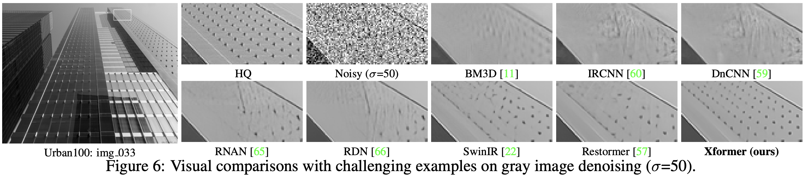

# Xformer: Hybrid X-Shaped Transformer for Image Denoising

Jiale Zhang, [Yulun Zhang](http://yulunzhang.com/), [Jinjin Gu](https://www.jasongt.com/), Jiahua Dong, [Linghe Kong](https://www.cs.sjtu.edu.cn/~linghe.kong/), and [Xiaokang Yang](https://scholar.google.com/citations?user=yDEavdMAAAAJ), "Xformer: Hybrid X-Shaped Transformer for Image Denoising", arXiv, 2023 [[arXiv](https://arxiv.org/abs/2303.06440)]

### 🔥🔥🔥 News

**2023-10-21:** We release this repository.

---

> **Abstract:** In this paper, we present a hybrid X-shaped vision Transformer, named Xformer, which performs notably on image denoising tasks. We explore strengthening the global representation of tokens from different scopes. In detail, we adopt two types of Transformer blocks. The spatialwise Transformer block performs fine-grained local patches interactions across tokens defined by spatial dimension. The channel-wise Transformer block performs direct global context interactions across tokens defined by channel dimension. Based on the concurrent network structure, we design two branches to conduct these two interaction fashions. Within each branch, we employ an encoder-decoder architecture to capture multi-scale features. Besides, we propose the Bidirectional Connection Unit (BCU) to couple the learned representations from these two branches while providing enhanced information fusion. The joint designs make our Xformer powerful to conduct global information modeling in both spatial and channel dimensions. Extensive experiments show that Xformer, under the comparable model complexity, achieves state-of-the-art performance on the synthetic and real-world image denoising tasks.


---

|                     HQ                     |                       LQ                        | [SwinIR](https://github.com/JingyunLiang/SwinIR) | [Restormer](https://github.com/swz30/Restormer) |                 Xformer (ours)                  |
| :----------------------------------------: | :---------------------------------------------: | :----------------------------------------------: | :-----------------------------------------: | :-----------------------------------------: |
|  |  |    |  |  |
|  |  |    |  |  |

## ⚒️ TODO

* [ ] Complete this repository

## 🔗 Contents

- [ ] Datasets
- [ ] Training
- [ ] Testing
- [x] [Results](#Results)
- [x] [Citation](#Citation)
- [x] [Acknowledgements](#Acknowledgements)

## 🔎 Results

We achieved state-of-the-art performance on Gaussian image denoising and real-world image denoising tasks. More results can be found in the paper.

<details>
<summary>Quantitative Comparison (click to expan)</summary>


- results in Table 2-4 of the main paper

<p align="center">
  
</p>
</details>

<details>
<summary>Visual Comparison (click to expan)</summary>


- results in Figure 4 of the main paper

<p align="center">
  
</p>


- results in Figure 6 of the main paper

<p align="center">
  
</p>

</details>

## 📎 Citation

If you find the code helpful in your resarch or work, please cite the following paper(s).

```
@article{zhang2023xformer,
      title={Xformer: Hybrid X-Shaped Transformer for Image Denoising}, 
      author={Jiale Zhang and Yulun Zhang and Jinjin Gu and Jiahua Dong and Linghe Kong and Xiaokang Yang},
      year={2023},
      eprint={2303.06440},
      archivePrefix={arXiv},
      primaryClass={cs.CV}
}
```

## 💡 Acknowledgements

This work is released under the Apache 2.0 license.
The codes are based on [Restormer](https://github.com/swz30/Restormer) and [BasicSR](https://github.com/XPixelGroup/BasicSR). Please also follow their licenses. Thanks for their awesome works.

